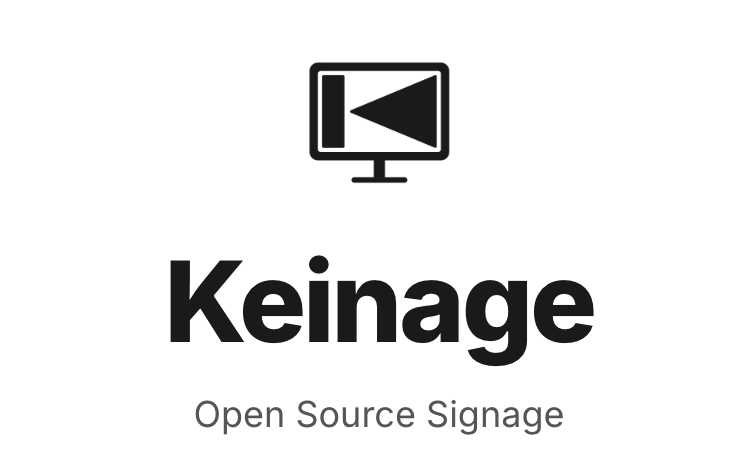
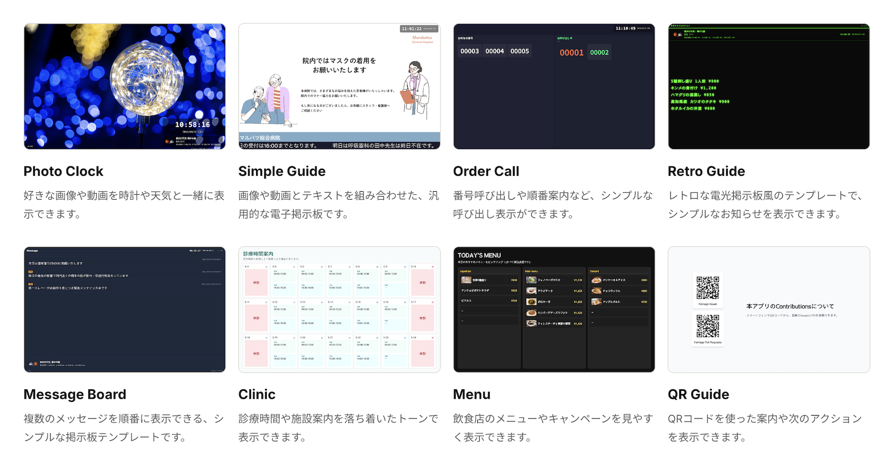

<p align="center">
  English | <a href="./README.ja.md">日本語</a>
</p>

# Keinage

<p align="center">

</p>
<p align="center">
<a href="https://keinage.com">keinage.com</a>
</p>
<p align="center">
A customizable web-based notice board, information display, and digital signage app
</p>

Keinage is an open-source digital signage web application that reflects dashboard changes on display devices in real time. It can show images, videos, messages, clocks, weather, and call numbers in hospital waiting rooms, stores, restaurants, offices, event venues, and more.

## Key Features

- **Template based**: Choose from notice boards, photo clocks, call-number displays, clinic hours, menus, and other purpose-built templates.
- **Real-time updates**: Changes made in the dashboard or through the API are delivered to display screens over SSE.
- **Owner / Shared users**: Invite Shared users into an Owner workspace for collaborative editing.
- **Self-hosted friendly**: The default setup has no billing, no plan restrictions, and uses local storage.
- **Official SaaS foundation**: Configure Stripe Billing, S3 / CloudFront, Google OAuth/OIDC, audit logs, and Super Owner capabilities.

## Template Examples



## Technology Stack

| Category | Technology |
| --- | --- |
| Language | TypeScript |
| Framework | Next.js 16 (App Router) |
| UI | Tailwind CSS v4, shadcn/ui, Framer Motion |
| Database | PostgreSQL, Drizzle ORM |
| Real-time communication | Server-Sent Events (SSE) |
| Authentication | Email + password, Google OAuth/OIDC, PIN, WebAuthn / Passkey |
| Storage | Local filesystem, S3-compatible storage |
| Containers | Docker, Docker Compose |

## Quick Start

### Requirements

- Node.js 20 or later
- pnpm 9 or later
- Docker / Docker Compose

### Start with Docker Compose

```bash
git clone https://github.com/HiroshiARAKI/Keinage.git
cd Keinage
cp .env.example .env
docker compose up -d
```

Open `http://localhost:3000` in a browser. On the first visit, register an Owner administrator account. After registration, set a six-digit PIN to enter the dashboard.

To stop the services:

```bash
docker compose down
```

To also delete Docker volumes containing the database and uploaded files:

```bash
docker compose down -v
```

## Default Self-hosted Mode

The defaults in `.env.example` let OSS and self-hosted users run Keinage without billing or plan restrictions.

```bash
BILLING_MODE=disabled
PLAN_ENFORCEMENT_MODE=unlimited
UPLOAD_MAX_BYTES=0
```

In this mode, billing links are hidden, plan restrictions are disabled, and media is stored in the local `uploads/` directory. Configure S3-compatible storage, RustFS / MinIO, or Stripe for the official SaaS mode only when needed.

## Documentation

| Document | Description |
| --- | --- |
| [docs/SPEC.md](docs/SPEC.md) | User-facing behavior, templates, and plan-specific features |
| [docs/DEPLOYMENT.md](docs/DEPLOYMENT.md) | Self-hosted and official SaaS environment variables, billing, storage, and deployment notes |
| [docs/DESIGN.md](docs/DESIGN.md) | Maintainer-oriented design, database schema, and implementation structure |
| [docs/API.md](docs/API.md) | Page routes, API Route Handlers, SSE, and upload delivery routes |
| [docs/SECURITY.md](docs/SECURITY.md) | Security configuration for production and official SaaS deployments |
| [docs/TRADEMARK.md](docs/TRADEMARK.md) | Rules for using the Keinage name, logo, and brand |

## Common Configuration Entry Points

- Email delivery: configure `APP_PUBLIC_ORIGIN` and `SMTP_*`.
- Google OAuth/OIDC: configure `GOOGLE_OAUTH_ENABLED=true` and `GOOGLE_OAUTH_*`.
- Passkeys: configure `WEBAUTHN_ENABLED=true` and `WEBAUTHN_*`.
- S3 / CloudFront: configure `S3_*` and `STORAGE_*`.
- Stripe Billing: configure `BILLING_MODE=stripe`, `PLAN_ENFORCEMENT_MODE=billing`, and `STRIPE_*`.
- Super Owner: configure `SUPER_OWNER_*`.
- Audit logs: configure `AUDIT_LOG_*`. When `AUDIT_LOG_RETENTION_DAYS` is a positive integer, logs older than that value are removed during container startup. Use `pnpm audit:cleanup` for manual or scheduled cleanup.
- Scheduled maintenance: `pnpm maintenance:cleanup` performs a dry run. Use `pnpm maintenance:cleanup -- --execute` to remove expired sessions, OAuth/signup flows, Stripe events, and incomplete direct uploads. `--orphan-media` reports unreferenced media candidates without deleting them.

See [docs/DEPLOYMENT.md](docs/DEPLOYMENT.md) for detailed examples and operational notes.

## Contributing

Issues and pull requests are welcome. Please use GitHub Issues for bug reports and feature requests.

## Acknowledgements

- Weather forecast data is provided by the [Weather Forecast API (livedoor Weather compatible)](https://weather.tsukumijima.net/).

## License

This project is licensed under the [Apache License 2.0](LICENSE). Personal, internal, commercial, and on-premises self-hosted use is permitted under its terms.

The Keinage name, logo, and branding that could imply an official service are not licensed under Apache License 2.0.

See [LICENSE](LICENSE), [NOTICE](NOTICE), and [docs/TRADEMARK.md](docs/TRADEMARK.md) for details.
