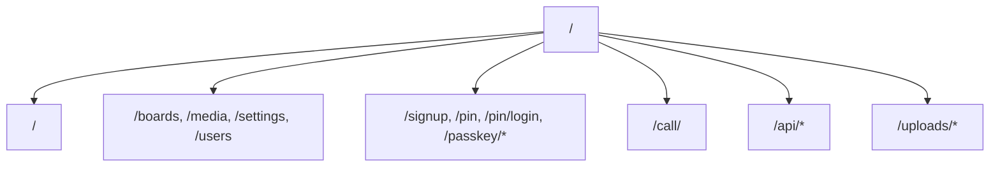
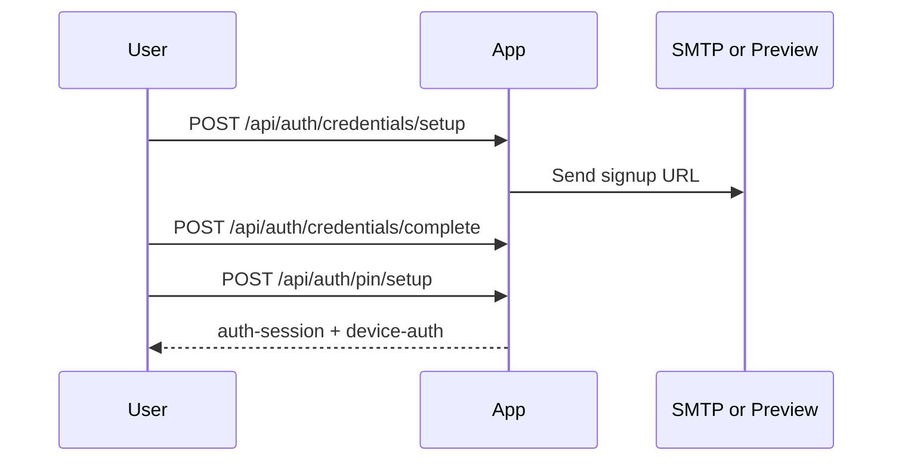
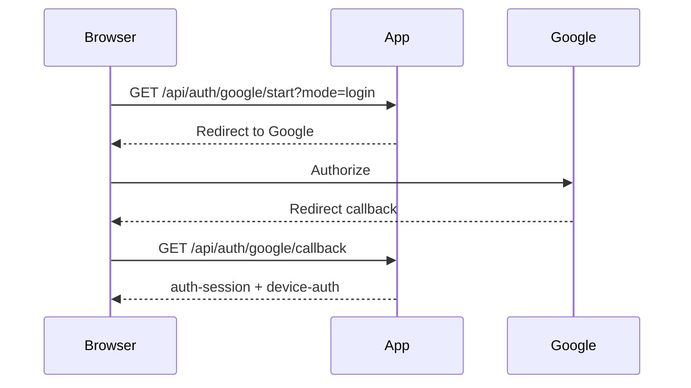
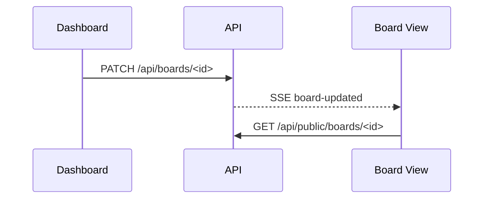

  English | <a href="./API.ja.md">日本語</a>

# Keinage Routing Reference

Last updated: April 30, 2026

## 1. Purpose

This document lists Keinage page routes and API Route Handlers. See [SPEC.md](./SPEC.md) for user-facing behavior and [DESIGN.md](./DESIGN.md) for internal design.

## 2. Route Overview

## 3. Page Routes

### 3.1 Public and Display Pages

| Path | Description | Authentication |
| --- | --- | --- |
| `/` | Entry point; redirects to a board, dashboard, or authentication based on current state | Context dependent |
| `/<boardId>` | Public board display | None |
| `/call/<boardId>` | Operator screen for the call-number template | Board call passcode |

### 3.2 Dashboard

| Path | Description | Authentication |
| --- | --- | --- |
| `/boards` | Board list | Required |
| `/boards/new` | Create a board | Required |
| `/boards/<boardId>` | Edit a board | Required |
| `/media` | Manage uploaded media | `admin` |
| `/billing` | Manage plans and billing | `admin`, when billing is enabled |
| `/status` | Usage, display-device status, and version information | `admin` |
| `/settings` | User and administrative settings | Required |
| `/users` | Manage Shared users | `admin` |
| `/super-owner/users` | Privacy-limited directory of all registered users | `super_owner` |
| `/delete-account` | Request Owner account deletion | Owner / `admin` |

### 3.3 Authentication and Registration

| Path | Description | Authentication |
| --- | --- | --- |
| `/signup` | Start Owner registration | None |
| `/signingup` | Wait for delivery of the Owner registration URL | `signup-request-id` cookie |
| `/signup/<token>` | Set the Owner password | Registration token |
| `/signup/shared?token=<token>` | Register a Shared user | Invitation token |
| `/pin/setup` | Set the initial PIN | Temporary setup session |
| `/pin` | PIN login | `device-auth` cookie |
| `/pin/login` | Full-authentication login | None |
| `/pin/forgot` | Request a PIN reset | None |
| `/pin/reset/<token>` | Reset a PIN | Reset token |
| `/passkey/setup` | Initial Owner Passkey registration | `auth-session`, including incomplete Passkey state |
| `/passkey/verify` | Additional Owner Passkey verification | `auth-session`, including incomplete Passkey state |
| `/deleting-account/<token>` | Confirm account deletion | Deletion token |
| `/deleted-account` | Account deletion completion page | None |

## 4. Cookies

| Cookie | Purpose |
| --- | --- |
| `auth-session` | Authenticated session |
| `device-auth` | Device-specific full-authentication history |
| `signup-request-id` | Identifies a pending Owner registration on `/signingup` |
| `google-oauth-state` | Validates Google OAuth/OIDC callback state |

Authentication cookies receive the `Secure` attribute when `NODE_ENV=production`. It is omitted in local development to support HTTP.

## 5. Authentication APIs

### 5.1 Owner and Shared User Registration

| Method | Path | Description | Authentication |
| --- | --- | --- | --- |
| `POST` | `/api/auth/credentials/setup` | Create a pending Owner registration and issue a registration URL | None |
| `POST` | `/api/auth/credentials/setup/resend` | Resend or reissue the Owner registration URL | `signup-request-id` cookie |
| `POST` | `/api/auth/credentials/complete` | Complete Owner password registration | Registration token |
| `POST` | `/api/auth/credentials/shared/complete` | Complete Shared user password registration | Invitation token |
| `GET` | `/api/auth/google/start` | Start Google OAuth/OIDC and redirect to Google | None |
| `POST` | `/api/auth/google/start` | Return the Google authorization URL as JSON | None |
| `GET` | `/api/auth/google/callback` | Process the Google callback and complete registration or login | State cookie |
| `POST` | `/api/auth/pin/setup` | Set the initial PIN | Temporary setup session |

`GET /api/auth/google/start` accepts `mode=login|owner-signup|shared-signup`, `redirectTo`, and `token`. Google OAuth/OIDC uses Authorization Code + PKCE, nonce, opaque state, and JWKS signature verification.

After Owner or Shared user registration completes, Keinage sends a localized completion email using the existing SMTP settings. The message follows `Accept-Language` and includes an acknowledgement and the `/pin/login` URL. Missing SMTP configuration or delivery failure does not roll back user creation or session issuance.

### 5.2 Login and Logout

| Method | Path | Description | Authentication |
| --- | --- | --- | --- |
| `POST` | `/api/auth/credentials/login` | Log in with email or user ID and password | None |
| `POST` | `/api/auth/pin/verify` | Log in with a PIN | `device-auth` cookie |
| `POST` | `/api/auth/pin/logout` | Delete the current session | Optional |
| `GET` | `/api/auth/pin/status` | Get the PIN-login target user and expiration state | Optional |
| `GET` | `/api/auth/webauthn/status` | Get WebAuthn / Passkey requirements | `auth-session`, including incomplete Passkey state |
| `POST` | `/api/auth/webauthn/register/start` | Issue Passkey registration options | Owner; incomplete Passkey state allowed |
| `POST` | `/api/auth/webauthn/register/finish` | Verify the registration response and save the credential | Owner; incomplete Passkey state allowed |
| `POST` | `/api/auth/webauthn/authenticate/start` | Issue Passkey authentication options | Owner; incomplete Passkey state allowed |
| `POST` | `/api/auth/webauthn/authenticate/finish` | Verify the authentication response and complete the session | Owner; incomplete Passkey state allowed |

Credential login, PIN verification, and Passkey completion APIs enforce failure limits. Client IP headers are trusted only when `TRUST_PROXY_HEADERS=true`.

Owner signup, signup resend, and Google OAuth start are also rate limited. Google OAuth/OIDC failure logs never include authorization codes, access tokens, ID tokens, or client secrets; only the external provider's HTTP status is recorded.

### 5.3 Account Settings

| Method | Path | Description | Authentication |
| --- | --- | --- | --- |
| `PATCH` | `/api/auth/password/change` | Change password | Required |
| `PATCH` | `/api/auth/pin/change` | Change PIN | Required |
| `POST` | `/api/auth/pin/forgot` | Send a PIN-reset URL | None |
| `POST` | `/api/auth/pin/reset` | Update a PIN with a reset token | Reset token |
| `POST` | `/api/auth/account-deletion/request` | Send an Owner account-deletion URL | Owner / `admin` |
| `POST` | `/api/auth/account-deletion/complete` | Confirm deletion; immediately cancel an active Stripe subscription before deletion when applicable | Deletion token |
| `GET` | `/api/account/webauthn/credentials` | List an Owner's registered Passkeys | Owner |
| `DELETE` | `/api/account/webauthn/credentials` | Delete a Passkey; the final credential cannot be removed when Passkeys are required | Owner |
| `PATCH` | `/api/users/me` | Update the current user's theme and locale | Required |
| `POST` | `/api/owner/onboarding/acknowledge` | Store the Owner onboarding acknowledgement timestamp | Owner |
| `POST` | `/api/contact` | Send a contact email | Required |

The contact path depends on the effective plan. Self-hosted / Unlimited links to GitHub Issues and Discussions. Free recommends upgrading and links to GitHub Issues. Lite, Standard, and Standard+ show the contact form when contact SMTP is configured. Owner, sender, and plan data are derived from the server-side session rather than hidden fields. Configure `CONTACT_SMTP_HOST`, `CONTACT_SMTP_PORT`, `CONTACT_SMTP_USER`, `CONTACT_SMTP_PASS`, `CONTACT_SMTP_FROM`, and `CONTACT_TO_EMAIL`. The API allows three submissions per Owner and IP per hour.

## 6. Board APIs

| Method | Path | Description | Authentication |
| --- | --- | --- | --- |
| `GET` | `/api/boards` | List boards the current user can edit | Required |
| `POST` | `/api/boards` | Create a board | Required |
| `GET` | `/api/boards/<id>` | Get board details | Required |
| `PATCH` | `/api/boards/<id>` | Update board settings | Required |
| `DELETE` | `/api/boards/<id>` | Delete a board | Required |
| `GET` | `/api/public/boards/<id>` | Get public board data | None |
| `POST` | `/api/public/boards/<id>/heartbeat` | Record a display device heartbeat | Display permission |

The public board response includes `boardPlan.watermark`, calculated server-side from the Owner's effective plan. It does not expose plan codes or subscription details. The watermark is a browser presentation feature, not a guarantee against removal or modification.

Display pages send heartbeats about every five minutes. For Self-hosted / Unlimited and Lite or higher plans, Keinage stores the User-Agent and last access time for each anonymous device-key and board pair. IP addresses are not stored. Private boards still require normal display authorization.

When an Owner leaves and has a cancellable Stripe subscription, deletion proceeds only after immediate Stripe cancellation succeeds. A failed cancellation leaves the account and data intact. Minimal billing tombstones retain Stripe identifiers so delayed webhooks cannot restore a paid plan.

Board updates and deletions emit SSE events for the affected board.

### 6.1 Security Headers

All routes return `X-Content-Type-Options`, `Referrer-Policy`, `X-Frame-Options`, `Permissions-Policy`, and `Cross-Origin-Opener-Policy`; production also returns `Strict-Transport-Security`. CSP requires deployment-specific allowlists for S3 presigned uploads, CloudFront, Google Fonts, and external images, so operational guidance is documented in [SECURITY.md](./SECURITY.md).

## 7. Media APIs

| Method | Path | Description | Authentication |
| --- | --- | --- | --- |
| `GET` | `/api/media` | List media registered in the database | Required |
| `POST` | `/api/media` | Upload media through the application server | Required |
| `POST` | `/api/media/direct/init` | Issue an S3 presigned PUT URL | Required |
| `POST` | `/api/media/direct/complete` | Register completion of an S3 direct upload | Required |
| `PATCH` | `/api/media` | Update media order and display duration | Required |
| `DELETE` | `/api/media` | Delete registered media in bulk | `admin` |
| `PATCH` | `/api/media/<id>` | Update one media item | Required |
| `DELETE` | `/api/media/<id>` | Delete one media item | Required |
| `GET` | `/api/media/files` | List uploaded files in storage | `admin` |
| `DELETE` | `/api/media/files` | Delete files from storage | `admin` |
| `GET` | `/uploads/<path>` | Deliver uploaded files | None or route authorization |

Supported image formats are JPEG, PNG, WebP, and GIF; supported video formats are MP4 and WebM. Uploads with mismatched Content-Type and extension are rejected. The effective plan's `maxUploadBytes` is the primary per-file limit. Self-hosted / Unlimited is unlimited by default, while a positive `UPLOAD_MAX_BYTES` applies a safety cap. `UPLOAD_MAX_BYTES=0` is unlimited. For `simple` and `photo-clock`, `boardMediaItems`, `boardVideos`, and `boardVideoDurationSeconds` also limit media count, video count, and video duration per board. Server uploads and direct-upload init / complete are rate limited per Owner.

New storage keys include Owner and board scope. With `STORAGE_DELIVERY_MODE=cloudfront-signed-url`, board APIs return `/uploads/<mediaId>`, which authorizes the request and redirects to a CloudFront signed URL. Without signed delivery, public-board media uses a configured `S3_PUBLIC_BASE_URL`, `STORAGE_PUBLIC_BASE_URL`, or `CLOUDFRONT_BASE_URL`. Private-board media remains behind the authorized `/uploads/<path>` route.

`GET /uploads/<path>` returns 404 if the storage key, or the source item for a thumbnail, has no `media_items` reference. Leftover files from failed deletion and direct uploads that never completed therefore remain inaccessible through the application even when the raw key is known. Video delivery supports byte ranges, returns `206 Partial Content` with `Content-Range` and `Accept-Ranges: bytes`, and returns `416 Range Not Satisfiable` for invalid ranges.

For S3 video uploads, the browser obtains a presigned URL, uploads directly to S3, and then calls the completion API. Keinage verifies Owner, board, plan, capacity, and resolution before signing and before registration. Completion uses `HeadObject` to verify actual size and Content-Type. Video duration is determined server-side with `ffprobe`; client-reported duration is not trusted. Objects that never complete have no database reference and cannot be delivered. Multipart uploads remain future work.

Direct upload sessions store the media ID, Owner/board scope, object key, and expiration, with a one-hour completion grace period. Successful registration removes the session. Expired sessions and unregistered objects are handled by scheduled maintenance.

Server-side video uploads are written to a temporary file and inspected with `ffprobe` for dimensions, rotation, and duration before permanent storage. Lite accepts up to FHD; Standard and Standard+ accept up to 4K. Temporary files are removed after validation.

Dimensions and video duration are stored on upload. Downgrades do not delete or convert existing media. Public responses add `playbackStatus` when a video is unavailable under the current plan or exceeds its resolution limit, and the display shows guidance instead of playing it. New uploads, template changes, and settings saves are rejected when current storage, image, board-media, video-count, or video-duration limits are exceeded.

## 8. Message APIs

| Method | Path | Description | Authentication |
| --- | --- | --- | --- |
| `GET` | `/api/boards/<id>/messages` | List board messages | Required |
| `DELETE` | `/api/boards/<id>/messages` | Delete all board messages | Required |
| `GET` | `/api/public/boards/<id>/messages` | List messages for public display | None |
| `POST` | `/api/messages` | Create a message | Required |
| `PATCH` | `/api/messages/<id>` | Update a message | Required |
| `DELETE` | `/api/messages/<id>` | Delete a message | Required |

Create and update requests accept `content`, `priority`, `expiresAt`, and `kind`. `kind` is `info`, `notice`, or `alert`, defaulting to `info`. Message changes emit an SSE event.

## 9. User and Operator APIs

| Method | Path | Description | Authentication |
| --- | --- | --- | --- |
| `GET` | `/api/users` | List users, invitations, and Shared user usage in the Owner scope | `admin` |
| `POST` | `/api/users` | Invite a Shared user | `admin` |
| `PATCH` | `/api/users/<id>` | Update a Shared user's role or plan-activation state | `admin` |
| `DELETE` | `/api/users/<id>` | Delete a Shared user | `admin` |
| `GET` | `/api/super-owner/status` | Get Super Owner authentication state | `super_owner` |
| `GET` | `/api/super-owner/users` | Get a paginated, privacy-limited directory of all users | `super_owner` |
| `GET` | `/api/super-owner/audit-logs` | List audit logs with supported filters | `super_owner` |
| `GET` | `/api/announcements` | List currently applicable announcements | Required |
| `POST` | `/api/announcements/<id>/read` | Mark an announcement as read | Required |
| `POST` | `/api/announcements/<id>/acknowledge` | Acknowledge a required announcement | Required |
| `GET` | `/api/super-owner/announcements` | List every operator announcement | `super_owner` |
| `POST` | `/api/super-owner/announcements` | Create an announcement | `super_owner` |
| `PATCH` | `/api/super-owner/announcements/<id>` | Edit an announcement | `super_owner` |
| `POST` | `/api/super-owner/announcements/<id>/publish` | Publish and optionally email an announcement | `super_owner` |
| `POST` | `/api/super-owner/announcements/<id>/archive` | Archive an announcement | `super_owner` |

Shared user creation, registration completion, and reactivation enforce the effective plan's `sharedUsers` limit. Exceeding it returns `403`, `code: "plan_limit_shared_user_count"`, `limit`, and `usage`. Users and invitations are always restricted to the Owner scope. Owner users cannot be deleted.

Super Owner is bootstrapped only through normal Owner registration and login when the configured `SUPER_OWNER_*` conditions match. Every Super Owner API requires server-side `requireSuperOwner()` authorization and records access in audit logs.

The Super Owner user directory returns only `userId`, `email`, `role`, `attribute`, `organizationName`, `plan`, `status`, and `createdAt`. A currently locked account reports `locked` without exposing internal UUIDs, lock expiration, or authentication data. `page` and `limit` are supported, with a maximum limit of 100.

Cross-cutting audit logs cover authentication, Passkeys, billing, Stripe webhooks, account deletion, and Super Owner operations. They never store passwords, tokens, secrets, card data, Stripe signatures, or WebAuthn challenges. IP addresses are hashed.

Regular users receive only announcements that are published, within their publication window, and applicable to their server-resolved effective plan. Publishing with `send_email=true` attempts delivery through existing SMTP settings without rolling back publication on failure.

## 10. Billing APIs

| Method | Path | Description | Authentication |
| --- | --- | --- | --- |
| `GET` | `/api/billing/plan` | Get the Owner's effective plan | `admin` |
| `GET` | `/api/billing/board-activation` | Get board candidates for the current or scheduled plan | `admin` |
| `POST` | `/api/billing/board-activation` | Save future candidates or apply active boards to the current plan | `admin` |
| `POST` | `/api/billing/checkout` | Create a paid-plan Checkout Session | Owner `admin` |
| `POST` | `/api/billing/portal` | Create a billing-management session | Owner `admin` |
| `POST` | `/api/billing/webhook` | Verify payment webhooks and synchronize the Owner subscription | Webhook signature |

During a scheduled downgrade, board activation stores `pending_active_board_ids`; board status changes immediately only when applying the current plan.

Only an Owner `admin` may perform payment-method, subscription-change, or cancellation operations. Shared `admin` users may inspect plan usage and adjust active-board candidates.

With `BILLING_MODE=disabled`, billing links are hidden and the webhook returns 404. Webhooks verify the raw body with `STRIPE_WEBHOOK_SECRET` and persist event IDs to prevent duplicate processing.

For `customer.subscription.*` and `subscription_schedule.*`, Keinage refetches Subscription / Subscription Schedule state from Stripe and synchronizes current price, period end, cancellation and end timestamps, and the next phase price. Scheduled downgrades and cancellations automatically choose `pending_active_board_ids` ordered by `last_viewed_at`, `updated_at`, and `created_at`, descending. At transition, only selected boards remain `active`; others become `inactive_due_to_plan`. Invalid or empty pending selections are regenerated to avoid disabling every board.

The Billing page combines plan, usage, and board-activation state to show current access duration, the future plan, and resources that exceed future limits. Plan-limit failures return `403` and machine-readable codes such as `plan_limit_board_count`, `plan_limit_storage`, `plan_limit_image_count`, `plan_limit_video_disabled`, `plan_limit_resolution`, `plan_limit_upload_size`, `plan_limit_template_disabled`, `plan_limit_board_media_count`, `plan_limit_board_video_count`, and `plan_limit_board_video_duration`. Limits are disabled in unlimited mode.

## 11. Settings and Utility APIs

| Method | Path | Description | Authentication |
| --- | --- | --- | --- |
| `GET` | `/api/settings` | Get Owner settings | `admin` |
| `PATCH` | `/api/settings` | Update Owner settings | `admin`; some values require Owner `admin` |
| `GET` | `/api/board-devices` | Get display-device last-access state | `admin` |
| `GET` | `/api/weather` | Get normalized weather data for the current Owner or board | None / private-board display permission |
| `GET` | `/api/version` | Get current and latest release information | None |
| `GET` | `/api/network` | Get network information | None |

Because `authExpireDays` applies to the entire Owner scope, only an Owner `admin` may update it. `/api/weather` resolves the Owner's configured location, queries the internal weather-provider service, and returns provider-independent condition, temperature, and four-period precipitation data. Forecasts are refreshed per provider and location every 30 minutes. Values already obtained for the same forecast date are retained when a later provider response omits them. Concurrent refreshes share one external request, and stale data is returned when a refresh fails after a successful fetch. Version information uses the GitHub Releases API.

## 12. SSE APIs

| Method | Path | Description | Authentication |
| --- | --- | --- | --- |
| `GET` | `/api/sse` | SSE connectivity endpoint | None |
| `GET` | `/api/sse/<boardId>` | Per-board SSE stream | None |

| Event | Trigger |
| --- | --- |
| `board-updated` | Board update or deletion |
| `media-updated` | Media creation, reorder, or deletion |
| `message-updated` | Message creation, update, or deletion |
| `weather-updated` | Weather location setting update |

## 13. Representative Flows

### 13.1 Owner Registration

### 13.2 Google Login

### 13.3 Board Update

