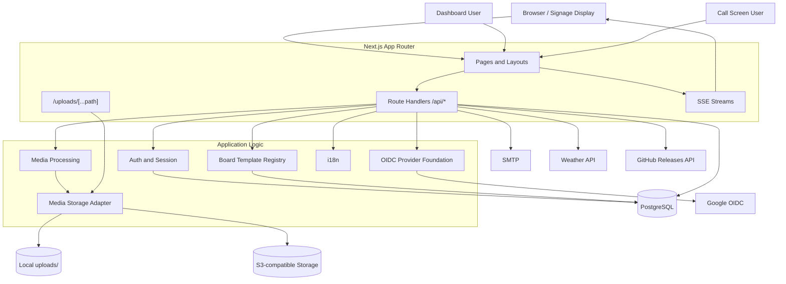
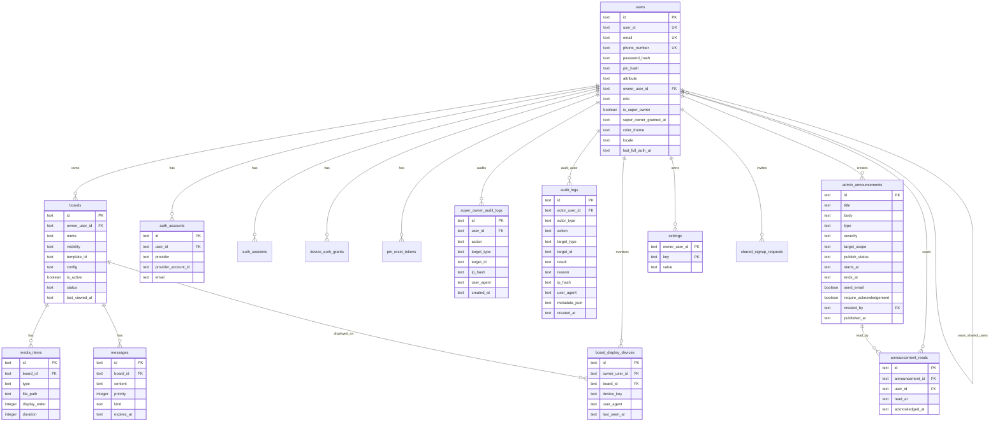
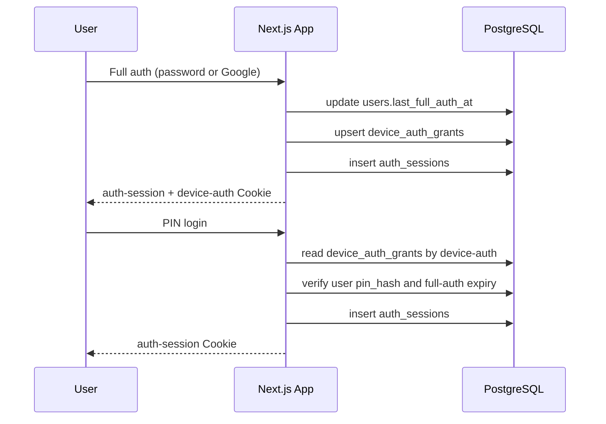
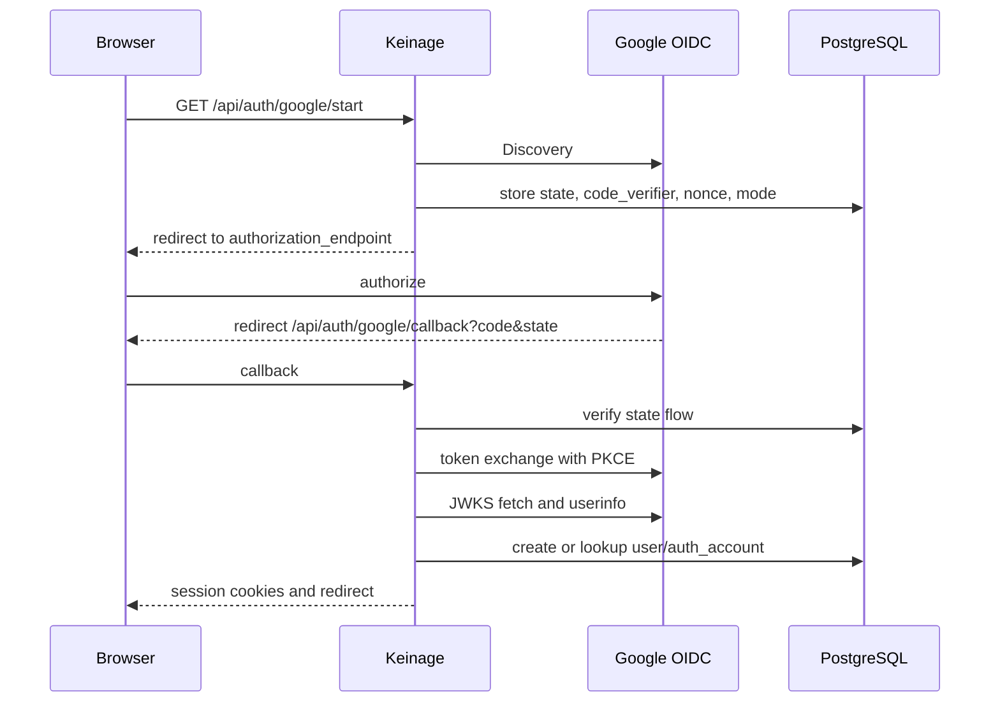
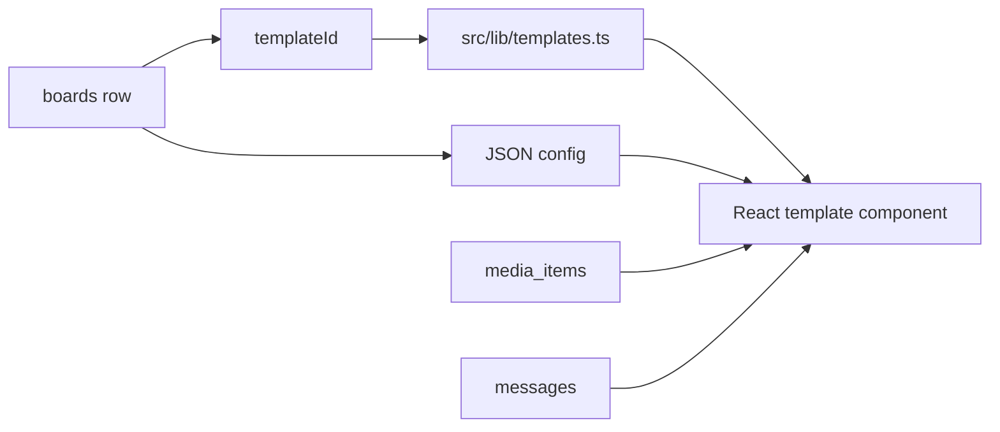
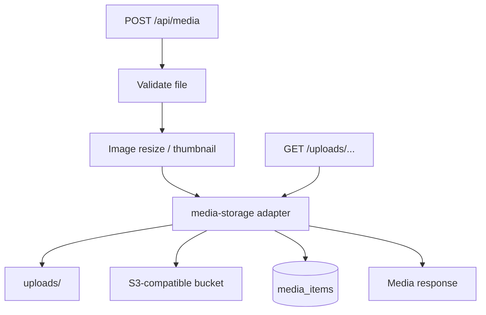
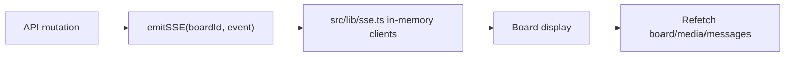

  English | <a href="./DESIGN.ja.md">日本語</a>

# Keinage Design

Last updated: May 3, 2026

## 1. Purpose

This document describes Keinage's architecture, technology choices, database schema, directory layout, internationalization, and major implementation decisions for maintainers and developers. See [SPEC.md](./SPEC.md) for user-facing behavior and [API.md](./API.md) for routes.

## 2. Architecture

Keinage uses one Next.js App Router application to provide display pages, the dashboard, and Route Handler APIs.

## 3. Technology

| Area | Technology |
| --- | --- |
| Framework | Next.js 16 App Router |
| Language | TypeScript |
| UI | React 19, Tailwind CSS v4, shadcn/ui, Framer Motion |
| Icons | lucide-react |
| Database | PostgreSQL |
| ORM | Drizzle ORM |
| Media processing | sharp |
| Real-time | Server-Sent Events |
| Authentication | App-session cookie, device-auth cookie, PIN, Google OAuth/OIDC, WebAuthn / Passkey |
| OIDC | Discovery, Authorization Code + PKCE, nonce, JWKS RS256 verification |
| Storage | Local filesystem or S3-compatible storage |
| Package manager | pnpm |
| Container | Docker with standalone Next.js output |

## 4. Directory Layout

| Path | Responsibility |
| --- | --- |
| `src/app` | App Router pages, Route Handlers, and upload delivery |
| `src/app/(board)` | Public board display |
| `src/app/(dashboard)` | Authenticated dashboard |
| `src/app/api` | API Route Handlers |
| `src/app/call` | Call Number operator screen |
| `src/app/uploads/[...path]` | Delivery of files from local or S3 storage |
| `src/components/board` | Board presentation, templates, and display components |
| `src/components/dashboard` | Dashboard UI |
| `src/components/auth` | Authentication UI |
| `src/components/i18n` | Client-side i18n provider |
| `src/db` | Drizzle schema and database connection |
| `src/lib` | Shared authentication, OIDC, SSE, media, settings, and i18n logic |
| `src/types` | Shared type definitions |
| `drizzle` | SQL migrations and snapshots |
| `docker` | Dockerfile, entrypoint, and migration runner |
| `uploads` | Media files when using local storage |

## 5. Database Schema

### 5.1 ER Diagram

### 5.2 Main Tables

| Table | Responsibility |
| --- | --- |
| `users` | Login principals, Owner/Shared relationship, roles, plan activation, Super Owner state, display settings, PIN, and authentication timestamps |
| `auth_accounts` | Authentication method and external account mapping; `provider + providerAccountId` is unique |
| `auth_sessions` | 24-hour application sessions |
| `device_auth_grants` | Per-device full-authentication history used to choose the PIN-login user |
| `webauthn_credentials` | Owner Passkey public key, counter, transports, and last-used time |
| `webauthn_challenges` | Single-use registration/authentication challenges and expiration |
| `audit_logs` | Cross-cutting authentication, billing, webhook, deletion, and Super Owner audit events |
| `super_owner_audit_logs` | Super Owner grants, API access, and privileged operations |
| `admin_announcements` | Operator announcements, severity, target plan, publication window, and email behavior |
| `announcement_reads` | Per-user read and acknowledgement state |
| `signup_requests` | Pending email/password Owner registration |
| `shared_signup_requests` | Shared invitations and invited, plan-inactive, completed, or cancelled state |
| `google_oauth_flows` | OAuth state, PKCE verifier, nonce, mode, and redirect target |
| `pin_reset_tokens` | PIN reset tokens |
| `account_deletion_requests` | Owner account-deletion tokens |
| `boards` | Board template ID and JSON configuration |
| `board_display_devices` | Anonymous device/board heartbeat, User-Agent, and last access |
| `media_items` | Images and videos associated with a board |
| `messages` | Messages associated with a board |
| `settings` | Owner-scoped key/value settings |
| `pin_attempts` | Authentication failures and rate-limit buckets |

## 6. Authentication Design

### 6.1 Session Model

Keinage separates full authentication from lightweight PIN reauthentication. Full authentication uses email + password or Google OAuth/OIDC. PIN login is restricted to the user associated with `device-auth` and is rejected after full authentication expires.

When Passkeys are required, new Owner sessions start with `webauthn_verified=false`. The dashboard layout and `getSessionUser()` block pending sessions. Only registration and verification pages temporarily accept them through `getSessionUserAllowingWebAuthnPending()`.

### 6.2 WebAuthn / Passkey

`src/lib/webauthn.ts` contains WebAuthn logic and resolves RP ID / Origin from `WEBAUTHN_RP_ID`, `WEBAUTHN_ORIGIN`, and `APP_PUBLIC_ORIGIN`. Start APIs store challenges in `webauthn_challenges`; completion APIs compare client data and consume a challenge exactly once.

Owners without credentials go to `/passkey/setup`; those with credentials go to `/passkey/verify`. Success marks the current session verified. Failures reuse the `pin_attempts` bucket and are limited to five per 24 hours.

### 6.3 Google OAuth/OIDC

Google is an OIDC provider preset with `issuer=https://accounts.google.com`. Provider-independent logic in `src/lib/oidc.ts` handles discovery, authorization URL generation, Authorization Code + PKCE exchange, issuer/audience/expiration/nonce verification, JWKS RS256 verification, and userinfo retrieval.

Google-specific routes remain under `src/app/api/auth/google/*` for compatibility, and environment variables retain the `GOOGLE_OAUTH_*` names.

### 6.4 Super Owner

Super Owner is an operator account with privileges beyond a normal Owner. It uses no hidden URL or initial password. Bootstrap compares the verified email of a normally registered and authenticated Owner with the configured email.

Bootstrap runs only when enabled, an email is configured, the user is an Owner `admin` with verified email, and no Super Owner exists. When Google is required, the current authentication path must be Google OIDC. A partial unique index on `users.is_super_owner=true` prevents a second Super Owner even under races or misconfiguration.

Every privileged operation calls `requireSuperOwner()` server-side. Grants and API access are stored in `super_owner_audit_logs`; IP addresses are hashed rather than stored directly.

The operator user directory is served at `/super-owner/users` and `/api/super-owner/users`. SQL selection and responses are restricted to approved fields. Authentication data, phone numbers, lock expiration, and other private values are excluded. Shared user organization and effective plan are resolved from the Owner, and a currently locked account receives only the derived `locked` status.

### 6.5 Operator Announcements

Super Owner creates announcements for official SaaS or self-hosted instances from `/announcements`. Records move among `draft`, `published`, and `archived`. Regular users receive only published records inside `starts_at` / `ends_at` that match their server-resolved effective plan.

Unread `high` / `critical` announcements appear in the dashboard header. Records with `require_acknowledgement=true` remain fixed in the lower-right corner until acknowledged. Read state is stored in `announcement_reads`. Publishing with `send_email=true` attempts SMTP delivery without rolling back publication; failure counts are recorded on the announcement and in Super Owner audit logs.

### 6.6 Audit Logs

`audit_logs` is written only through `writeAuditLog()` / `writeUserAuditLog()` in `src/lib/audit-log.ts`. Logging failures normally do not stop the user operation; `serverLog()` emits a structured terminal error.

Raw IP addresses are never stored. When configured, `AUDIT_LOG_IP_HASH_SECRET` is used with HMAC-SHA256; otherwise SHA-256 with a fixed salt is used. `metadata_json` is minimal, and keys such as password, token, secret, signature, cookie, credential, and challenge are redacted before terminal or database output.

`AUDIT_LOG_ENABLED=false` disables database persistence but retains terminal logs for important events. Super Owner can inspect recent entries through `/api/super-owner/audit-logs`.

`docker/cleanup-audit-logs.cjs` removes records older than `AUDIT_LOG_RETENTION_DAYS` when it is a positive integer. It runs after migrations during container startup and can be scheduled through `pnpm audit:cleanup`. A PostgreSQL advisory lock prevents concurrent cleanup. Existing-log cleanup continues even when new audit persistence is disabled.

`docker/maintenance-cleanup.cjs` is an optional long-running maintenance job. It defaults to dry-run and deletes expired sessions, OAuth flows, signup requests, retained processed Stripe events, and expired direct-upload sessions only with `--execute`. Direct-upload init stores the object key and completion grace deadline; successful completion consumes the session. Cleanup never deletes objects with registered media rows.

Orphan media reporting compares storage objects with `media_items.file_path`. The initial implementation reports count and size only, including local uploads, and never automatically deletes orphan media. The whole job uses an advisory lock.

## 7. Board and Template Design

Templates use a registry. `boards.templateId` chooses the implementation, while `boards.config` stores template-specific JSON without schema expansion.

Adding a template requires a display component, default config, dashboard editor when needed, i18n strings, and registry entry.

The five standard templates are `simple`, `photo-clock`, `retro`, `message`, and `call-number`. Extended templates are `clinic-hours`, `restaurant-menu`, and `qr-info`; Free creation and changes are restricted by `PlanLimits.extendedTemplates`. Restaurant menu images are controlled by `PlanLimits.menuItemImages` and `boardPlan.menuItemImages`.

`LiveBoard` creates a virtual canvas normalized to 1080 px height and scales it to the display with `transform: scale()`. Canvas width follows the real aspect ratio. Template roots use parent-relative `width: 100%` / `height: 100%`, and font settings are design points displayed as `pt`.

Simple Board and Photo Clock scheduling lives in `boards.config`, primarily under `mediaSchedules`, `messageSchedules`, and `fallbackMediaId`. `src/lib/scheduling.ts` evaluates schedules using the display browser's local `Date`.

`PlanLimits.scheduling` defines allowed scheduling. `sanitizeSchedulingConfig` removes all scheduling for Free and date ranges for Lite. Public board responses include `boardPlan.scheduling`, and display components also enforce the plan.

Plan activation uses `boards.status`: `active` means available under the plan; `inactive_due_to_plan` means disabled by a downgrade. Existing `is_active` remains the user's display on/off switch. Successful display requests periodically update `last_viewed_at` for downgrade candidate selection.

On a scheduled Stripe downgrade or cancellation, Keinage refetches Subscription / Subscription Schedule state rather than trusting webhook payloads alone. It stores current and pending prices, period and cancellation timestamps, schedule ID, effective date, and `pending_active_board_ids`. Candidates are ordered by `last_viewed_at`, `updated_at`, and `created_at`, descending. At transition, only candidates remain active; missing or invalid selections are regenerated.

`src/lib/plan-impact.ts` compares `OwnerUsage` with a target `PlanDefinition` and reports board, image, storage, video, resolution, and per-file overages. Billing uses the same result for future-plan warnings, current over-limit guidance, and plan comparison.

Shared user limits are centralized in `PlanLimits.sharedUsers` and `src/lib/shared-user-plan.ts`. Active users and unexpired invited requests count. Creation, completion, and reactivation validate server-side. When a plan change takes effect, existing active users are prioritized, excess users become `inactive_due_to_plan`, and their sessions are deleted. Unlimited mode uses a `null` limit and reactivates plan-disabled users and invitations.

## 8. Media Storage and Delivery

`src/lib/media-storage.ts` abstracts local and S3-compatible storage.

`file_size_bytes` and `thumbnail_size_bytes` contribute to Owner storage usage. Width, height, and video duration are captured at upload. Existing media is not automatically deleted or resized; new uploads, template changes, settings saves, and video playback are restricted when current limits are exceeded.

- Database paths use `/uploads/<filename>`.
- New object keys use `owners/<owner>/boards/<board>/media/<mediaId>.<ext>`; thumbnails use `media/thumbs/` in the same scope. Existing flat keys remain readable.
- Without S3 configuration, files go to `uploads/`. S3 requires region and bucket. Explicit credentials are used only when both key and secret are present; otherwise the AWS SDK provider chain is used.
- With CloudFront signed delivery, board URLs use `/uploads/<mediaId>`. The upload route verifies board visibility and Owner scope before a 302 redirect. Signing uses `STORAGE_CDN_BASE_URL`, `CLOUDFRONT_KEY_PAIR_ID`, `CLOUDFRONT_PRIVATE_KEY`, and the configured expiry.
- Without signed delivery, public base URLs are considered in configured order. Private boards remain behind authorized `/uploads/[...path]` delivery with `private, no-store`.
- `src/lib/image.ts` handles image resize and thumbnails.
- The upload route reads dynamic files in standalone builds and supports byte ranges for both local and S3 video delivery.

## 9. Real-time Updates

Keinage uses Server-Sent Events rather than WebSockets.

Subscribers are held in process memory. Cross-instance event distribution is not currently supported.

## 10. Internationalization

| File | Responsibility |
| --- | --- |
| `src/lib/i18n.ts` | Supported locales, fallback, and formatting helpers |
| `src/lib/i18n/messages/*.ts` | Per-locale UI message catalogs |
| `src/lib/i18n/messages/index.ts` | Catalog aggregation and shared types |
| `src/lib/i18n-messages.ts` | Compatibility re-export |
| `src/lib/i18n-server.ts` | Request locale resolution for Server Components and Route Handlers |
| `src/components/i18n/LocaleProvider.tsx` | Client-side locale context |

Locale resolution order is user setting, cookie, then `Accept-Language`. New UI strings are added first to `en-US.ts` and then to every locale with the same key. `satisfies Record<MessageKey, string>` catches missing translations at type-check time.

## 11. Settings

| Type | Storage | Examples |
| --- | --- | --- |
| User settings | `users` | `colorTheme`, `locale`, user ID, email, PIN |
| Owner settings | `settings` | `weatherCityId`, `imageMaxLongEdge`, `authExpireDays` |

Owner settings use a key/value model so new settings can be introduced without database migrations. Type conversion and defaults live in `src/lib/owner-settings.ts`, Route Handlers, and UI code.

## 12. External Integrations

| Service | Purpose |
| --- | --- |
| Google OIDC | Google account registration and login |
| SMTP | Registration, invitations, PIN reset, and account-deletion URLs |
| weather.tsukumijima.net | Weather display |
| GitHub Releases API | Latest-version checks |
| S3-compatible storage | Media storage |

## 13. Docker and Deployment

Docker uses a multi-stage build:

1. `deps`: install pnpm dependencies
2. `builder`: run `pnpm build`
3. `runner`: execute standalone output and static assets

`docker/entrypoint.sh` runs migrations before `node server.js`. In Docker Compose, the application starts after the PostgreSQL health check passes.

## 14. Development Notes

- Review authorization boundaries for every Route Handler.
- Add all new UI strings to the i18n catalogs.
- Preserve backward compatibility when adding template configuration.
- Do not use `0.0.0.0` for OAuth redirects; use `http://localhost:3000` locally.
- SSE assumes a single process. Horizontal scaling requires shared pub/sub.
